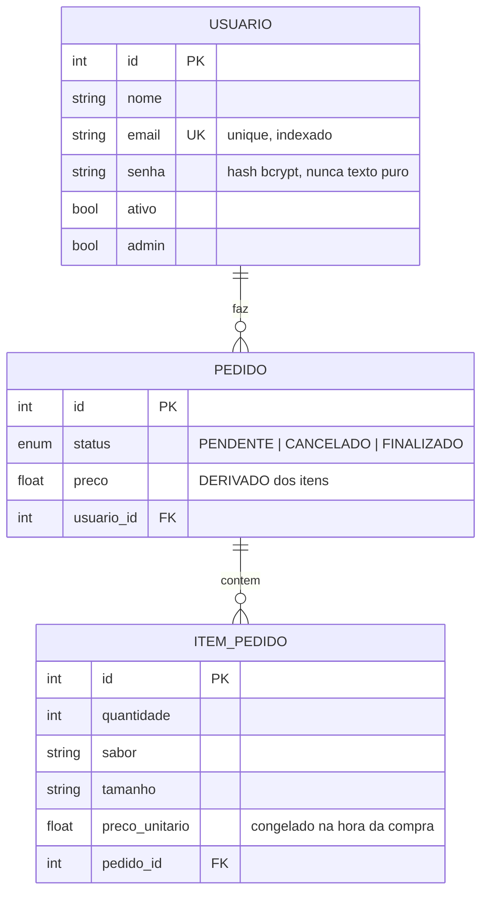

# Modelagem de Dados

Anotacoes sobre as decisoes de modelagem deste projeto. Cada secao explica **o que
foi feito, por que, e o que acontece se voce fizer diferente**.

---

## 1. O diagrama



Le-se: **um** usuario faz **varios** pedidos; **um** pedido contem **varios** itens.
Sao dois relacionamentos 1:N em cascata.

A notacao `||--o{` diz exatamente isso: de um lado exatamente um (`||`), do outro
zero ou muitos (`o{`). Um usuario recem-cadastrado tem zero pedidos — por isso `o`
e nao `|`.

---

## 2. Como um 1:N vira codigo

Um relacionamento 1:N precisa de **duas** coisas, e elas vivem em camadas diferentes:

```python
# No LADO N (Pedido): a chave estrangeira. Isso e uma coluna real no banco.
usuario_id = Column("usuario_id", Integer, ForeignKey("usuarios.id"), nullable=False)

# Nos DOIS lados: o relationship. Isso NAO e coluna — e acucar do SQLAlchemy
# para voce navegar entre objetos em Python.
class Usuario(Base):
    pedidos = relationship("Pedido", back_populates="usuario")

class Pedido(Base):
    usuario = relationship("Usuario", back_populates="pedidos")
```

**A `ForeignKey` e a verdade; o `relationship` e a conveniencia.** Se voce apagar os
`relationship`, o banco continua correto — voce so perde o `usuario.pedidos` e passa a
escrever `session.query(Pedido).filter(Pedido.usuario_id == u.id).all()` na mao.

O `back_populates` liga os dois lados. Sem ele, o SQLAlchemy trata `Usuario.pedidos` e
`Pedido.usuario` como relacionamentos independentes e eles saem de sincronia dentro da
mesma sessao: voce faz `pedido.usuario = u` e `u.pedidos` continua vazio ate o commit.

### Por que `nullable=False` na FK

Sem isso, o banco aceita um pedido com `usuario_id = NULL` — um pedido orfao, sem dono.
Ai a rota `/pedidos` quebra na hora de decidir quem pode ver o quê. Regra: **se a
entidade nao faz sentido sem o pai, a FK e `nullable=False`.**

---

## 3. `cascade="all, delete-orphan"`

```python
itens = relationship("ItemPedido", back_populates="pedido",
                     cascade="all, delete-orphan")
```

Duas coisas separadas nesse `cascade`:

- **`delete`** (parte do `all`): apagou o pedido, apaga os itens junto. Sem isso, os
  itens ficam apontando para um `pedido_id` que nao existe mais — **lixo referencial**.
- **`delete-orphan`**: tirou o item da lista `pedido.itens`, ele e apagado. Sem isso, o
  SQLAlchemy so seta `pedido_id = NULL` e o item vira orfao no banco.

Teste mental: `ItemPedido` existe sozinho, sem pedido? Nao. Entao cascade. Ja `Usuario`
sobrevive sem pedidos, entao apagar um pedido **nao** apaga o usuario — e por isso que
o cascade fica declarado no lado "um", olhando pro lado "muitos", e nunca o contrario.

---

## 4. Dado derivado: o preco NUNCA vem do cliente

Este e o erro de modelagem mais comum em API de pedido:

```python
# ERRADO — o cliente manda o preco
class PedidoSchema(BaseModel):
    preco: float          # <- eu mando {"preco": 0.01} e sua pizza sai de graca
```

O preco do pedido e **derivado**: ele e uma funcao dos itens, nao um dado de entrada.
Quem calcula e o servidor, sempre, depois de qualquer mudanca na lista de itens:

```python
def calcular_preco(self):
    self.preco = sum(item.preco_unitario * item.quantidade for item in self.itens)
    return self.preco
```

Repare que `PedidoSchema` (a entrada) so tem `usuario_id`. O `preco` aparece so em
`PedidoResponse` (a saida). **Todo campo calculavel a partir de outros e um candidato a
ataque se voce deixar o cliente escrever nele.**

### E por que guardar o preco, se da pra calcular?

Boa pergunta — e a resposta e "depende". Guardar um dado derivado e **desnormalizacao**:
voce troca pureza por velocidade. Aqui vale a pena porque listar 500 pedidos sem a coluna
`preco` exigiria carregar os itens de todos eles so pra somar.

O preco que voce paga: a coluna pode **dessincronizar** da verdade. Por isso `calcular_preco()`
e chamado em *toda* rota que mexe em item (`adicionar_item`, `remover_item`). Esqueceu uma?
O total mente. Esse e o risco real da desnormalizacao — nao e teorico.

---

## 5. `preco_unitario` no item, nao no "produto"

```python
class ItemPedido(Base):
    preco_unitario = Column("preco_unitario", Float, nullable=False)
```

Parece redundante ("o preco da pizza G ja nao esta na tabela de produtos?"), mas nao e.
Se a pizzaria reajustar a tabela amanha, **os pedidos de ontem nao podem mudar de valor
sozinhos**. Congelar o preco no momento da compra e o que garante isso.

Regra geral: **dado historico se copia, nao se referencia.** Nota fiscal, extrato,
pedido fechado — tudo isso guarda o valor da epoca, nao um ponteiro pro valor atual.

---

## 6. `Enum` em vez de `String` solta

Antes:

```python
status = Column("status", String)     # aceita "PENDENTE", "pendente", "banana", ""
```

Agora:

```python
class StatusPedido(str, enum.Enum):
    PENDENTE = "PENDENTE"
    CANCELADO = "CANCELADO"
    FINALIZADO = "FINALIZADO"

status = Column("status", Enum(StatusPedido), default=StatusPedido.PENDENTE,
                nullable=False)
```

Tres ganhos de uma vez:

1. O **banco** rejeita valor fora da lista (vira um `CHECK constraint`).
2. O **Pydantic** rejeita na entrada e ainda documenta os valores validos no `/docs`.
3. O **editor** autocompleta `StatusPedido.` e voce para de errar `"FINALIZADO"` vs
   `"finalizado"`.

O truque do `str` em `class StatusPedido(str, enum.Enum)`: sem ele, o JSON da resposta
sairia como `{"status": "StatusPedido.PENDENTE"}` em vez de `{"status": "PENDENTE"}`.

### A maquina de estados

```
                 +-----------+
                 | PENDENTE  |  <- todo pedido nasce aqui
                 +-----------+
                  /         \
      cancelar   /           \  finalizar (exige >= 1 item)
                v             v
        +-----------+   +------------+
        | CANCELADO |   | FINALIZADO |
        +-----------+   +------------+
             (estados finais: imutaveis)
```

Modelar isso explicitamente e o que permite escrever a guarda:

```python
def _exigir_pendente(pedido):
    if pedido.status != StatusPedido.PENDENTE:
        raise HTTPException(400, f"Pedido {pedido.status.value} nao pode mais ser alterado")
```

Sem essa guarda, da pra **adicionar item num pedido ja finalizado** — o total muda depois
do cliente ter pago. Bug classico de quem modela status como string e nunca escreve as
transicoes.

---

## 7. `unique=True` no e-mail

```python
email = Column("email", String, nullable=False, unique=True, index=True)
```

Duas defesas distintas, e voce precisa das **duas**:

- **`unique=True`** — a garantia real, no banco. Nem que dois cadastros cheguem no mesmo
  milissegundo, o segundo estoura `IntegrityError`.
- **A checagem na rota** — o que da uma mensagem decente (`400 "Ja existe uma conta com
  esse e-mail"`) em vez de um `500`.

Se voce so tem a checagem na rota, existe uma janela entre o `SELECT` e o `INSERT` onde
dois requests simultaneos passam os dois (isso e uma **race condition** — o classico
TOCTOU, *time-of-check to time-of-use*). O `unique` fecha essa janela.

O `index=True` e performance: toda vez que alguem loga, roda um
`WHERE email = ?`. Sem indice, isso e uma varredura na tabela inteira.

---

## 8. O que a senha ensina sobre modelagem

```python
senha = Column("senha", String, nullable=False)   # guarda o HASH, nunca o texto
```

E o `UsuarioResponse` **nao tem o campo `senha`** — por isso os schemas existem separados
dos models. Se voce devolvesse o objeto `Usuario` direto, o FastAPI serializaria o hash
junto. Nao e o fim do mundo (hash bcrypt nao e reversivel), mas e informacao de graca pra
um atacante: ele descobre o algoritmo e o custo, e ja sabe o que vai precisar quebrar.

**Modelagem tem lado de saida.** "Quais campos o cliente pode ver" e uma pergunta de
design tanto quanto "quais colunas a tabela tem".

---

## 9. `create_all` nao e migration

```python
Base.metadata.create_all(bind=db)
```

Isso cria as tabelas **que ainda nao existem**. So isso. Se voce mudar uma coluna depois
(adicionar campo, trocar tipo), `create_all` **nao faz nada** — ele ve que a tabela existe
e passa direto. Voce roda o servidor, nao da erro nenhum, e a coluna simplesmente nao esta
la.

Enquanto voce estuda, a saida e apagar `banco.db` e deixar recriar:

```bash
rm banco.db && python models.py
```

Em producao voce nao pode apagar o banco. Ai entra o **Alembic**, que versiona o schema
igual o git versiona o codigo:

```bash
pip install alembic
alembic init alembic
# aponte sqlalchemy.url e target_metadata=Base.metadata em alembic/env.py
alembic revision --autogenerate -m "cria tabelas de pedido"
alembic upgrade head
```

Cada mudanca de schema vira um arquivo de migration com `upgrade()` e `downgrade()`.
Fica de exercicio (ver [exercicios.md](exercicios.md), #10).

---

## 10. Checklist de modelagem

Rode isso mentalmente em toda tabela nova:

- [ ] Toda tabela tem PK (`primary_key=True, autoincrement=True`).
- [ ] Toda FK tem `ForeignKey("tabela.coluna")` **e** `nullable=False` se o pai for obrigatorio.
- [ ] Todo `relationship` tem `back_populates` nos dois lados.
- [ ] Filho que nao vive sozinho → `cascade="all, delete-orphan"` no pai.
- [ ] Campo com lista fechada de valores → `Enum`, nunca `String`.
- [ ] Campo de identidade unica (e-mail, CPF, slug) → `unique=True` **e** `index=True`.
- [ ] Campo derivado (total, subtotal, contagem) → calculado no servidor, **fora** do schema de entrada.
- [ ] Dado historico (preco, endereco de entrega) → **copiado**, nao referenciado.
- [ ] Segredo (senha, token) → hash no banco, **ausente** do schema de resposta.
- [ ] Mudou o schema depois do banco criado? → migration, nao `create_all`.
